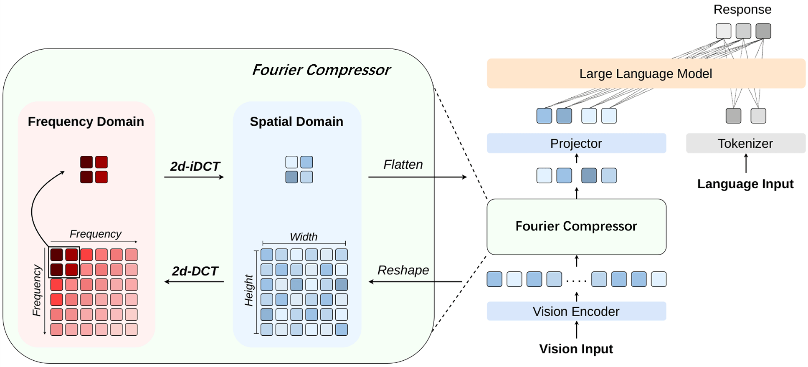

<div align="center">

# Fourier Compressor: Frequency-Domain Visual Token Compression for Vision-Language Models

Huanyu Wang, Jushi Kai, Haoli Bai, Lu Hou, Bo Jiang, Ziwei He, Zhouhan Lin

LUMIA Lab, Shanghai Jiao Tong University

 [](https://arxiv.org/abs/2508.06038) [](https://huggingface.co/collections/whyisverysmart/fourier-compressor)

-----------------
</div>

## TL;DR

We present **Fourier Compressor**, a simple and parameter-free visual token compression module for VLMs. Our method removes redundancy in the **frequency domain** via two-dimensional Discrete Cosine Transform (DCT), preserving semantic fidelity with negligible overhead. Fourier Compressor generalizes effectively across multiple VLM architectures, including LLaVA, Qwen2-VL, and Qwen2.5-VL, for both image and video tasks.

<div align="center">
  
</div>

## Repository Structure

```text
Fourier-Compressor/
├── fourier_compressor/
│   ├── compress.py              # model-agnostic compression
│   ├── dct.py                   # torch DCT / IDCT implementation
│   └── integrations/
│       ├── llava/               # LLaVA patch and source-edit notes
│       └── qwen_vl/             # Qwen2/2.5-VL patch and helpers
├── examples/
│   ├── infer_llava.py
│   ├── infer_qwen2_vl.py
│   └── infer_qwen2_5_vl.py
└── README.md
```

## Installation

LLaVA and Qwen2/2.5-VL use different `transformers` stacks, so we recommend separate environments.

```bash
# LLaVA environment
conda create -n fourier-llava python=3.10 -y
conda activate fourier-llava
# Install LLaVA following the official LLaVA repository.
```

```bash
# Qwen2-VL / Qwen2.5-VL environment
conda create -n fourier-qwen python=3.12 -y
conda activate fourier-qwen
pip install "transformers==4.51.3" qwen-vl-utils
```

Install Fourier Compressor after the model-specific dependencies:

```bash
git clone https://github.com/whyisverysmart/Fourier-Compressor
cd Fourier-Compressor
pip install -e .
```

## Usage

### LLaVA-1.5

Patch LLaVA before loading the model:

```python
from fourier_compressor.integrations.llava import apply_to_llava

apply_to_llava(reserve=12)  # 24x24 -> 12x12 visual tokens

# Load and run LLaVA as usual.
```

Example:

```bash
python examples/infer_llava.py --image your.jpg --reserve 12
```

### Qwen2-VL

Qwen2-VL requires two synchronized changes: compressing the visual output and updating the number of visual placeholder tokens emitted by the processor.

```python
import torch
from transformers import AutoProcessor, Qwen2VLForConditionalGeneration
from fourier_compressor.integrations.qwen_vl import apply_to_qwen2_vl

model_id = "Qwen/Qwen2-VL-2B-Instruct"
model = Qwen2VLForConditionalGeneration.from_pretrained(
    model_id, torch_dtype=torch.bfloat16, device_map="auto"
)
processor = AutoProcessor.from_pretrained(
    model_id,
    min_pixels=256*28*28,
    max_pixels=2304*28*28,
)

apply_to_qwen2_vl(model, processor, ratio=2/3)

# Build inputs and generate as in the official Qwen-VL examples.
```

Example:

```bash
python examples/infer_qwen2_vl.py --image your.jpg --ratio 0.6666667
```

### Qwen2.5-VL

Qwen2.5-VL uses the same integration logic under `transformers==4.51.3`.

```python
import torch
from transformers import AutoProcessor, Qwen2_5_VLForConditionalGeneration
from fourier_compressor.integrations.qwen_vl import apply_to_qwen2_5_vl

model_id = "Qwen/Qwen2.5-VL-3B-Instruct"
model = Qwen2_5_VLForConditionalGeneration.from_pretrained(
    model_id, torch_dtype=torch.bfloat16, device_map="auto"
)
processor = AutoProcessor.from_pretrained(
    model_id,
    min_pixels=256*28*28,
    max_pixels=2304*28*28,
)

apply_to_qwen2_5_vl(model, processor, ratio=2/3)
```

Example:

```bash
python examples/infer_qwen2_5_vl.py --image your.jpg --ratio 0.6666667
```

## Evaluation

For benchmark evaluation, follow the original evaluation scripts of the corresponding model repository, or evaluate through `lmms-eval`.

## Model Weights

| Model | Base Model | Visual Tokens | Compression | Weights |
|---|---|---|---|---|
| Fourier-LLaVA-v1.5-7B-256 | LLaVA-v1.5-7B | 256 | 55.6% | [🤗 HF](https://huggingface.co/whyisverysmart/Fourier-LLaVA-v1.5-7B-256) |
| Fourier-LLaVA-v1.5-7B-144 | LLaVA-v1.5-7B | 144 | 75.0% | [🤗 HF](https://huggingface.co/whyisverysmart/Fourier-LLaVA-v1.5-7B-144) |
| Fourier-LLaVA-v1.5-7B-64 | LLaVA-v1.5-7B | 64 | 88.9% | [🤗 HF](https://huggingface.co/whyisverysmart/Fourier-LLaVA-v1.5-7B-64) |
| Fourier-LLaVA-v1.5-7B-36 | LLaVA-v1.5-7B | 36 | 93.8% | [🤗 HF](https://huggingface.co/whyisverysmart/Fourier-LLaVA-v1.5-7B-36) |
| Fourier-LLaVA-v1.5-13B-144 | LLaVA-v1.5-13B | 144 | 75.0% | [🤗 HF](https://huggingface.co/whyisverysmart/Fourier-LLaVA-v1.5-13B-144) |
| Fourier-Qwen2-VL-2B-0.67 | Qwen2-VL-2B-Instruct | Dynamic | 55.6% | [🤗 HF](https://huggingface.co/whyisverysmart/Fourier-Qwen2-VL-2B-0.67) |
| Fourier-Qwen2.5-VL-3B-0.67 | Qwen2.5-VL-3B-Instruct | Dynamic | 55.6% | [🤗 HF](https://huggingface.co/whyisverysmart/Fourier-Qwen2.5-VL-3B-0.67) |

## Citation

```bibtex
@article{wang2025fourier,
    title={Fourier Compressor: Frequency-Domain Visual Token Compression for Vision-Language Models},
    author={Wang, Huanyu and Kai, Jushi and Bai, Haoli and Hou, Lu and Jiang, Bo and He, Ziwei and Lin, Zhouhan},
    journal={arXiv preprint arXiv:2508.06038},
    year={2025}
}
```
